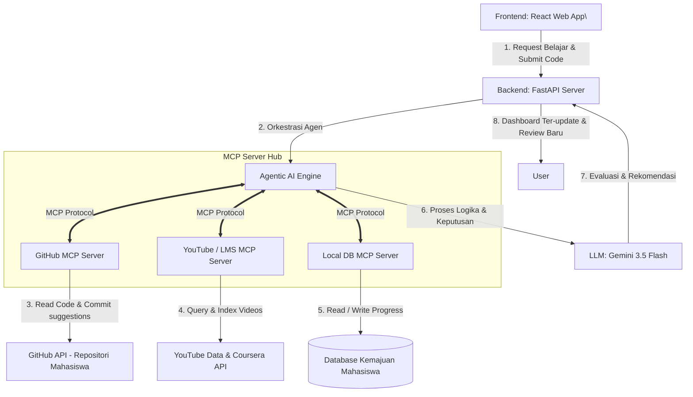

# PROPOSAL SOLUSI DIGITAL BERBASIS AGENTIC AI
**TUGAS UTS - REKAYASA PERANGKAT LUNAK AGENTIC AI (SEMESTER 5)**

---

## 📋 IDENTITAS MAHASISWA & PROYEK
* **Nama Platform:** LearnIT Copilot
* **Fokus Proyek:** Asisten Pembelajaran IT Adaptif & Pendampingan Karir Mahasiswa Vokasi Berbasis Agentic AI
* **Target Bidang:** Rekayasa Perangkat Lunak, Full-Stack Web Development (React/Next.js/Node.js), DevOps, dan Data Engineering.
* **Tujuan Akhir:** Membimbing mahasiswa dari tingkat semester aktif saat ini secara terarah hingga siap bekerja (*job-ready*) di industri teknologi.

---

## 01. PROBLEM DISCOVERY (Bobot 20%)

### A. Problem Statement
Banyak mahasiswa IT, khususnya di tingkat politeknik/vokasi, mengalami fenomena *tutorial hell* dan kebingungan arah belajar karena terlalu luasnya ekosistem teknologi. Kurikulum kampus yang bersifat umum dan lambat diperbarui sering kali menyisakan *skill gap* (kesenjangan keterampilan) yang besar dengan standar industri. Mahasiswa kesulitan mengukur apakah portofolio kode yang mereka bangun sudah memenuhi standar industri (*clean code, secure, scalable*) karena tidak adanya akses ke mentor profesional untuk melakukan *code review* personal secara berkala.

* **Siapa Target Penggunanya?**
  Mahasiswa aktif rumpun IT (Teknik Informatika, RPL, Sistem Informasi) Semester 5 yang sedang mempersiapkan diri untuk magang industri atau transisi ke dunia kerja profesional.
* **Seberapa Besar Masalah Tersebut?**
  Menurut data survei industri, lebih dari 65% lulusan baru IT memerlukan waktu pelatihan tambahan (*retraining*) selama 3-6 bulan setelah diterima kerja karena kode mereka belum berstandar industri.

### B. User Persona (Detail)
* **Nama:** Rian Wibowo (21 Tahun)
* **Profil:** Mahasiswa D4 Teknik Informatika, Semester 5 di salah satu Politeknik Negeri.
* **Tujuan (Goals):**
  * Ingin menguasai spesialisasi **Full-Stack Web Developer** (React/Next.js & Node.js) yang siap kerja dalam waktu 6 bulan.
  * Ingin membangun portofolio riil di GitHub yang diakui dan dinilai tinggi oleh rekruter perusahaan teknologi nasional.
* **Kebutuhan (Needs):**
  * Peta belajar (*learning path*) yang langsung merujuk pada kebutuhan industri saat ini, bukan teori usang.
  * Umpan balik instan dan mendetail terhadap kualitas kode pemrograman yang ia tulis.
* **Rasa Frustrasi (Pain Points):**
  * Bingung memilah tutorial di YouTube/Udemy yang sangat banyak namun tidak terstruktur.
  * Tidak tahu apakah aplikasi web full-stack yang dibuatnya sudah menerapkan *state management* (seperti Zustand/Redux Toolkit) dan *clean architecture* (seperti Repository Pattern/MVC) dengan benar karena tidak ada yang memeriksa.
  * Cemas menghadapi *live coding* dan wawancara teknis (*technical interview*).

### C. Root Cause Analysis (Analisis Akar Masalah)
Menggunakan metode **5 Whys** untuk menemukan akar masalah pengangguran/kesulitan kerja lulusan baru IT:
1. **Mengapa banyak lulusan IT kesulitan menembus seleksi kerja di perusahaan teknologi bagus?**
   * *Karena mereka gagal pada tahap tinjauan portofolio kode dan tes live coding.*
2. **Mengapa mereka gagal pada tes portofolio kode dan live coding?**
   * *Karena proyek yang mereka buat di kampus hanya sekadar 'jalan' tanpa memedulikan aspek arsitektur kode, efisiensi algoritma, dan standar industri.*
3. **Mengapa mereka tidak tahu cara menulis kode dengan standar industri?**
   * *Karena kurikulum perguruan tinggi fokus pada fondasi teoritis dasar, dan dosen tidak memiliki cukup waktu untuk memberikan tinjauan kode (code review) baris-per-baris secara personal ke puluhan mahasiswa.*
4. **Mengapa mahasiswa tidak belajar secara mandiri di luar kampus saja?**
   * *Karena sumber belajar mandiri sangat banyak (fragmented) dan mahasiswa mengalami kelelahan informasi (information overload) serta tidak memiliki mentor untuk memvalidasi kemajuan belajar mereka.*
5. **Mengapa mereka tidak memiliki mentor profesional?**
   * *Karena menyewa mentor profesional atau pengulas kode industri sangat mahal dan tidak terjangkau bagi sebagian besar mahasiswa vokasi.*

> **AKAR MASALAH:** Tidak adanya sistem bimbingan terstruktur dan umpan balik (*code review*) baris-per-baris yang personal, murah, dan adaptif untuk mengarahkan proses belajar mahasiswa IT menuju standar industri.

---

## 02. AI QUESTION ENGINEERING (Bobot 30%)
*Mahasiswa bertindak sebagai Founder dan memosisikan AI sebagai Asisten Virtual Co-Founder. Berikut adalah 60 prompt terstruktur yang dirancang secara detail untuk menyusun konsep LearnIT Copilot:*

### A. Eksplorasi Masalah (20 Prompt)
1. *"Sebagai co-founder virtual saya, berikan analisis mendalam mengenai 5 kesalahan paling umum dalam penulisan kode (code smells) yang sering dilakukan mahasiswa IT semester 5 saat membuat aplikasi web modern React/Next.js pertama mereka."*
2. *"Uraikan kesenjangan terbesar antara materi kuliah struktur data di kampus dengan implementasi struktur data riil dalam proyek database berskala besar di industri saat ini."*
3. *"Menurut perspektif rekruter teknologi senior, apa saja 3 parameter utama yang membuat portofolio GitHub seorang fresh graduate langsung ditolak pada penyaringan awal?"*
4. *"Analisis mengapa metode pembelajaran berbasis video satu arah (seperti Udemy) sering kali gagal membantu mahasiswa IT keluar dari 'Tutorial Hell'. Apa komponen interaktif yang hilang?"*
5. *"Bagaimana tren kebutuhan industri terhadap peran DevOps di tahun ini? Keterampilan dasar apa yang wajib dikuasai mahasiswa jika mereka ingin langsung menembus posisi Junior DevOps?"*
6. *"Uraikan masalah psikologis seperti imposter syndrome yang dihadapi mahasiswa IT semester 5 ketika melihat lowongan kerja magang dengan persyaratan teknologi yang sangat banyak."*
7. *"Identifikasi kendala utama dosen di politeknik dalam memberikan umpan balik (feedback) coding yang mendalam bagi setiap mahasiswa di kelas berkapasitas 30 orang."*
8. *"Bagaimana standar industri mendefinisikan 'Clean Code' pada proyek backend Node.js? Berikan 5 contoh konkret perbedaan kode mahasiswa vs kode profesional."*
9. *"Analisis apa dampak dari keterlambatan pembaharuan kurikulum kampus IT terhadap daya saing lulusan vokasi di pasar kerja regional."*
10. *"Mengapa kemampuan melakukan debugging mandiri menjadi kelemahan terbesar lulusan IT baru? Mengapa mereka sangat bergantung pada mesin pencari tanpa memahami akar masalah?"*
11. *"Uraikan tantangan terbesar dalam mempelajari konsep Object-Oriented Programming (OOP) secara abstrak tanpa proyek riil yang relevan dengan industri."*
12. *"Analisis kebutuhan industri terhadap spesialisasi Data Engineer junior. Apakah pemahaman SQL dasar saja sudah cukup untuk bersaing saat ini? Mengapa?"*
13. *"Bagaimana ekosistem teknologi open-source di GitHub dapat dimanfaatkan secara sistematis sebagai indikator kelayakan kerja mahasiswa IT?"*
14. *"Tolong jelaskan konsep arsitektur berlapis (layered architecture) seperti Clean Architecture dan Repository Pattern pada Node.js/Express dan mengapa mahasiswa sangat kesulitan menerapkannya tanpa bimbingan berkala."*
15. *"Apa saja kelemahan utama dari tugas akhir mahasiswa IT yang biasanya dikerjakan secara berkelompok dalam merepresentasikan kemampuan coding individu?"*
16. *"Analisis mengapa tes live coding (seperti HackerRank) menjadi momok menakutkan bagi mahasiswa IT, meskipun mereka memiliki nilai akademik IPK tinggi."*
17. *"Bagaimana cara industri menguji aspek keamanan kode (security) pada aplikasi web junior developer? Apa celah keamanan yang paling sering dibiarkan oleh mahasiswa?"*
18. *"Uraikan pentingnya pemahaman Git workflows (seperti Git Branching, Pull Requests, Code Review) bagi mahasiswa sebelum mereka memasuki lingkungan kerja nyata."*
19. *"Mengapa mahasiswa IT sering kali mengabaikan pembuatan dokumentasi kode (seperti README.md dan API docs)? Apa dampaknya terhadap penilaian rekruter?"*
20. *"Analisis tren pergeseran dari Fullstack Developer menjadi spesialisasi khusus (Frontend/Backend) di industri startup. Manakah jalur yang lebih realistis untuk dicapai mahasiswa dalam waktu 6 bulan?"*

### B. Validasi Solusi (20 Prompt)
21. *"Jika kita membuat asisten AI yang secara otomatis memeriksa commit GitHub mahasiswa dan memberikan saran perbaikan arsitektur kode secara baris-per-baris, apakah ini efektif secara pedagogis untuk menggantikan mentor manusia?"*
22. *"Bagaimana cara merancang sistem grading otomatis berbasis AI yang adil, yang tidak hanya menilai apakah kode sukses dikompilasi, tetapi juga menilai kompleksitas waktu (Big O Notation)?"*
23. *"Validasi ide kami untuk menggunakan Model Context Protocol (MCP) guna mencari dan menyusun kurikulum video belajar secara real-time dari YouTube berdasarkan deteksi skill gap mahasiswa. Apa potensi kendala akurasinya?"*
24. *"Seberapa efektif simulasi technical interview berbasis teks dan suara yang dipandu AI dalam melatih kesiapan mental mahasiswa menghadapi wawancara kerja asli?"*
25. *"Apakah modul pembelajaran adaptif yang menyesuaikan tingkat kesulitan latihan coding secara dinamis terbukti meningkatkan retensi belajar mahasiswa IT?"*
26. *"Validasi pendekatan kami yang mewajibkan mahasiswa menghubungkan akun GitHub mereka sejak awal pendaftaran di platform. Bagaimana hal ini membantu AI memetakan profil kemampuan awal mereka?"*
27. *"Jika AI kami memberikan ulasan kode otomatis, bagaimana cara mencegah mahasiswa melakukan plagiarisme atau sekadar menyalin solusi langsung dari AI tanpa memahaminya?"*
28. *"Bagaimana cara terbaik mengukur peningkatan kompetensi coding mahasiswa setelah menggunakan platform LearnIT Copilot selama 3 bulan? Metrik kuantitatif apa yang valid?"*
29. *"Validasi ide fitur 'Scrum Simulator' di mana AI bertindak sebagai Product Owner yang memberikan tiket tugas Jira tiruan kepada mahasiswa untuk diselesaikan lewat kode."*
30. *"Seberapa akurat asisten AI dalam memprediksi kesiapan kerja (*job-readiness*) seorang mahasiswa berdasarkan riwayat repositori GitHub dan nilai proyek mereka?"*
31. *"Bagaimana tanggapan industri jika universitas menggunakan sertifikat evaluasi portofolio dari LearnIT Copilot sebagai pengganti transkrip nilai akademik konvensional?"*
32. *"Apakah integrasi AI Code Reviewer ke dalam alur Git commit (sebagai pre-commit hook) akan membebani mahasiswa atau justru mendidik mereka menulis kode bersih sejak awal?"*
33. *"Bagaimana rancangan modul simulasi debugging, di mana AI secara sengaja memasukkan bug tersembunyi ke dalam kode mahasiswa dan menantang mereka menyelesaikannya?"*
34. *"Validasi solusi kami untuk mengintegrasikan modul soft skills (seperti komunikasi teknis) di mana AI menilai bagaimana mahasiswa menjelaskan arsitektur kode mereka lewat pesan suara."*
35. *"Apakah rancangan jalur belajar dinamis (dynamic roadmapping) dapat memicu kelelahan mental (*burnout*) bagi mahasiswa jika AI terus-menerus mendeteksi kekurangan skill mereka?"*
36. *"Bagaimana cara memastikan bahwa rekomendasi materi pembelajaran yang dicari oleh MCP di YouTube terbebas dari video tutorial berkualitas rendah atau sudah kedaluwarsa?"*
37. *"Apakah fitur simulasi sistem terdistribusi (seperti microservices) dapat disederhanakan agar bisa dijalankan dan dinilai secara otomatis oleh AI di server lokal berspesifikasi rendah?"*
38. *"Validasi model bisnis freemium bagi institusi kampus. Apakah kampus tertarik membayar lisensi LearnIT Copilot jika platform ini terbukti meningkatkan daya serap kerja lulusan?"*
39. *"Bagaimana cara meminimalkan bias AI ketika menilai kode mahasiswa yang menggunakan gaya penulisan alternatif (non-konvensional) namun tetap efisien?"*
40. *"Seberapa efektif integrasi forum diskusi peer-to-peer yang dimoderasi oleh AI agent untuk menjawab pertanyaan teknis mahasiswa secara instan?"*

### C. Analisis Kompetitor (10 Prompt)
41. *"Bandingkan fitur asisten AI pada platform belajar seperti Coursera Coach dengan konsep LearnIT Copilot. Apa kelemahan utama Coursera dalam hal analisis portofolio kode riil mahasiswa?"*
42. *"Analisis platform pencarian kerja seperti LinkedIn Jobs. Mengapa platform tersebut tidak mampu menyelesaikan masalah skill gap mahasiswa sejak awal kuliah, dan bagaimana LearnIT Copilot memposisikan diri?"*
43. *"Evaluasi kelebihan dan kekurangan asisten AI GitHub Copilot sebagai alat bantu coding mahasiswa. Mengapa GitHub Copilot terkadang membuat mahasiswa malas berpikir, dan bagaimana asisten kami mengatasinya?"*
44. *"Bagaimana platform LeetCode melatih algoritma mahasiswa, tetapi kurang dalam melatih pembangunan aplikasi dunia nyata (software engineering)? Bagaimana LearnIT mengisi celah ini?"*
45. *"Analisis kompetitor lokal seperti Dicoding atau Ruangguru. Apa batasan mereka dalam hal kustomisasi jalur belajar adaptif berbasis AI untuk setiap individu?"*
46. *"Bagaimana platform penilaian kode otomatis seperti HackerRank sering kali membuat mahasiswa frustrasi karena aturan test case yang kaku? Bagaimana pendekatan kami lebih humanis?"*
47. *"Apakah ada platform open-source yang memiliki kemiripan fitur dengan LearnIT Copilot? Lakukan analisis SWOT terhadap 3 proyek open-source teratas di bidang edutech AI."*
48. *"Analisis bagaimana bootcamp coding intensif (seperti Hacktiv8 atau Purwadhika) memvalidasi portofolio lulusan mereka. Mengapa biaya mereka sangat mahal dan bagaimana AI kami mendemokratisasi hal tersebut?"*
49. *"Bagaimana keefektifan sistem review kode manual oleh mentor manusia pada platform Dicoding dibanding dengan kecepatan dan skalabilitas tinjauan kode otomatis dari AI kami?"*
50. *"Analisis kesenjangan fitur antara platform manajemen pembelajaran (LMS) kampus konvensional (seperti Moodle) dengan arsitektur interaktif cerdas LearnIT Copilot."*

### D. Inovasi Fitur (10 Prompt)
51. *"Berikan ide inovatif tentang bagaimana AI dapat mensimulasikan situasi kegagalan server produksi (production crash) secara real-time dan menantang mahasiswa tingkat lanjut untuk melakukan hotfix."*
52. *"Bagaimana kita bisa merancang fitur 'AI Code Refactoring Battle' di mana mahasiswa berlomba-lomba mengoptimalkan kode yang berantakan menjadi kode yang paling efisien, dinilai secara real-time oleh AI?"*
53. *"Rancang konsep fitur asisten karir proaktif yang secara otomatis mengirimkan profil GitHub mahasiswa yang telah dinyatakan 'Job-Ready' oleh AI langsung ke rekruter mitra industri."*
54. *"Bagaimana cara mengimplementasikan visualisasi grafik pohon keterampilan (Skill Tree) interaktif ala game RPG, di mana cabang keahlian baru terbuka setelah AI menyetujui merge request mahasiswa?"*
55. *"Berikan konsep fitur 'AI Pair Programmer' yang bersifat edukatif, di mana AI tidak menuliskan kode secara langsung, melainkan memberikan petunjuk konsep secara bertahap saat mahasiswa mengalami stuck."*
56. *"Bagaimana kita bisa memanfaatkan teknologi AI generatif untuk secara otomatis membuat dokumentasi proyek (seperti Swagger API docs) dari kode yang ditulis oleh mahasiswa sebagai sarana edukasi?"*
57. *"Rancang fitur simulasi rapat perencanaan proyek (Sprint Planning) di mana AI berperan sebagai Product Owner dan Scrum Master, berinteraksi dengan mahasiswa menggunakan input suara."*
58. *"Bagaimana cara membangun fitur pelacakan kemajuan belajar psikometris yang mendeteksi tingkat frustrasi mahasiswa berdasarkan kecepatan mengetik dan pola error kode mereka?"*
59. *"Rancang konsep sistem penghargaan (reward system) berbasis blockchain atau sertifikasi digital terverifikasi yang langsung terintegrasi dengan verifikasi portofolio otomatis AI."*
60. *"Bagaimana inovasi fitur 'AI Code Historian' yang dapat menceritakan sejarah evolusi kode mahasiswa dari semester 1 hingga semester 5 untuk menunjukkan perkembangan pola pikir mereka kepada calon pemberi kerja?"*

---

## 03. PERAN AGENTIC AI & MODEL CONTEXT PROTOCOL (MCP) (Bobot 20%)

### A. Pembagian Kerja (Division of Labor)

| Aktivitas Pengembangan | Dikerjakan Secara Otonom oleh Agentic AI | Dikerjakan oleh Mahasiswa IT |
| :--- | :--- | :--- |
| **Penyusunan Kurikulum** | ✓ Mengkurasi dan menyusun materi adaptif (video YouTube & artikel) berdasarkan profil kekurangan skill pengguna. | Menentukan spesialisasi IT yang ingin ditargetkan (misal: Full-Stack Web Developer). |
| **Ulasan Kode (Code Review)** | ✓ Menganalisis repository GitHub mahasiswa secara baris-per-baris, mendeteksi *code smells*, celah keamanan, dan performa kompleksitas. | Menulis kode aplikasi, melakukan commit, dan membuka Pull Request di GitHub. |
| **Evaluasi Proyek** | ✓ Menjalankan unit testing otomatis dan memberikan skor kelayakan kode berdasarkan standar industri. | Memperbaiki bug dan melakukan refactoring kode berdasarkan saran perbaikan AI. |
| **Simulasi Wawancara** | ✓ Melakukan simulasi *technical interview* interaktif menyesuaikan respon mahasiswa secara dinamis. | Menjawab pertanyaan wawancara teknis secara langsung (teks/suara). |
| **Pengambilan Keputusan** | Memberikan rekomendasi kelayakan kerja (*Job-Readiness score*). | ✓ Mengambil keputusan akhir untuk melamar pekerjaan yang direkomendasikan platform. |

### B. Arsitektur Model Context Protocol (MCP)
**Model Context Protocol (MCP)** adalah standar yang menghubungkan kecerdasan LLM secara aman dengan data lokal dan API eksternal. Di LearnIT Copilot, LLM tidak hanya menghasilkan teks pasif, tetapi bertindak sebagai agen aktif dengan menggunakan 3 server MCP khusus:



1. **GitHub MCP Server:** Menghubungkan LLM secara langsung dengan repositori GitHub mahasiswa. Agen dapat mendownload kode sumber, membaca file konfigurasi (seperti `pubspec.yaml` atau `package.json`), menulis komentar *review* pada baris kode tertentu di Pull Request, dan membuka *issues* otomatis jika menemukan bug fatal.
2. **YouTube & LMS MCP Server:** Memungkinkan LLM untuk melakukan pencarian video tutorial terstruktur secara langsung, menyaring materi berdasarkan lisensi dan ulasan positif, serta merangkai tautan video YouTube terpilih menjadi kurikulum harian tanpa mahasiswa harus keluar dari aplikasi.
3. **Local Database MCP Server:** Menghubungkan LLM dengan database relasional lokal mahasiswa untuk menyimpan status kelulusan topik belajar, skor *code review*, dan grafik perkembangan pohon keterampilan (*Skill Tree*).

---

## 04. SOLUTION PROPOSAL & ARCHITECTURE (Bobot 20%)

### A. Value Proposition
> **"Mengubah Mahasiswa IT Menjadi Profesional Siap Kerja Lewat Peta Belajar Adaptif, Tinjauan Kode Otomatis di GitHub, dan Simulasi Karir Bertenaga Agentic AI."**

### B. Fitur Utama Platform
1. **Adaptive Pathfinder:** Peta jalan belajar yang dipersonalisasi sesuai spesialisasi IT yang dipilih. Kurikulum akan otomatis memendek atau memanjang menyesuaikan dengan kecepatan belajar dan pemahaman mahasiswa.
2. **Autonomous Git Auditor (AGA):** Agen AI yang bertindak sebagai *Senior Engineer virtual*. Setiap kali mahasiswa melakukan `git push` ke repositori proyek mereka, agen ini akan mengaudit arsitektur kode dan memberikan *inline comments* di GitHub mengenai optimasi kode.
3. **Role-Based Interview Simulator:** Simulator wawancara teknis interaktif yang menyesuaikan pertanyaannya secara real-time dengan kode proyek yang pernah dibuat mahasiswa di GitHub mereka, menciptakan simulasi wawancara kerja yang sangat akurat.

---

### C. Mockup Antarmuka Sederhana (ASCII Mockup)

#### 1. Dasbor Utama: Peta Belajar (Adaptive Pathfinder)
```text
================================================================================
  LearnIT Copilot v1.0 | Selamat Datang, Rian Wibowo! [Level 5: Web Developer Path]
================================================================================
  Target Karir: Junior Full-Stack Web Developer | Skor Kesiapan Kerja: 72% [========= ]
--------------------------------------------------------------------------------
  [SKILL TREE PETA BELAJAR]
  
  (x) 1. Dasar HTML, CSS & JavaScript ES6+ (Selesai)
  (x) 2. React Hooks & Component Lifecycle (Selesai)
  ( ) 3. State Management (Zustand / Redux) <== FOKUS ANDA SEKARANG!
      |--> [Rekomendasi Video 1]: Panduan Lengkap Zustand oleh Web Programming UNPAS (20 Menit)
      |--> [Rekomendasi Video 2]: React State Management Best Practices (25 Menit)
      |--> [Tugas Praktik]: Buat aplikasi e-commerce sederhana dengan Zustand.
  ( ) 4. Next.js App Router & Server Actions
  ( ) 5. REST API & Database Integration (Prisma, PostgreSQL/MongoDB)
  ( ) 6. CI/CD, Containerization (Docker) & Deploy ke Vercel/AWS
  
--------------------------------------------------------------------------------
  [Aksi]: [1] Buka Materi Belajar | [2] Hubungkan Repositori Tugas | [3] Keluar
================================================================================
```

#### 2. Antarmuka Ulasan Kode Otomatis (Autonomous Git Auditor)
```text
================================================================================
  Autonomous Git Auditor | Tinjauan Repositori: rianwibowo/e-commerce-zustand
================================================================================
  Analisis Commit: "feat: implement cart state with zustand" | Skor Kualitas: B+
--------------------------------------------------------------------------------
  [TEMUAN AUDIT KODE]
  
  [FILE]: src/store/useCartStore.js
  ------------------------------------------------------------------------------
  Line 42:
  - // Kode Anda:
  - const res = await fetch('/api/products');
  - const data = await res.json();
  - set({ products: data });
  
  + // Rekomendasi Agen AI (Zustand & Fetch Optimization):
  + try {
  +   set({ loading: true, error: null });
  +   const res = await fetch('/api/products');
  +   if (!res.ok) throw new Error('Gagal mengambil data produk');
  +   const data = await res.json();
  +   set({ products: data, loading: false });
  + } catch (err) {
  +   set({ error: err.message, loading: false });
  + }
  
  * Alasan AI: "Anda lupa menangani status loading, error, dan validasi response status HTTP. Hal ini bisa menyebabkan UI freeze atau error tidak termanifestasi dengan baik kepada pengguna saat koneksi gagal."
  
--------------------------------------------------------------------------------
  [Pilihan]: [1] Terima Saran Refactoring | [2] Lewati | [3] Tanya AI Mengapa
================================================================================
```

#### 3. Simulator Wawancara Kerja IT (Interview Simulator)
```text
================================================================================
  Simulator Wawancara Cerdas | Posisi: Junior Full-Stack Web Developer
================================================================================
  Interviewer AI: "Halo Rian. Saya melihat di proyek e-commerce-zustand Anda,
  Anda mengimplementasikan Zustand. Bisa Anda jelaskan mengapa Anda
  memilih Zustand dibanding Redux Toolkit untuk kasus manajemen state aplikasi tersebut?"
  
  Rian (User): [Mengetik jawaban atau menggunakan Input Suara...]
  > "Saya memilih Zustand karena boilerplate-nya sangat sedikit, konfigurasinya sederhana, tidak membutuhkan Context Provider di root app, dan kinerjanya sangat cepat karena tidak memicu re-render di komponen yang tidak berlangganan."
  
  Evaluasi Real-Time Agen AI:
  * Skor Jawaban Anda: 85/100 (Sangat Bagus!)
  * Umpan Balik AI: "Jawaban Anda tepat sasaran. Namun, Anda akan mendapatkan
    nilai tambah jika menjelaskan juga mengenai bagaimana Zustand menggunakan closures untuk mengelola state dan bagaimana selectors digunakan untuk mengoptimalkan re-rendering secara granular."
    
  [Pertanyaan Berikutnya...]
  Interviewer AI: "Bagus. Sekarang, bagaimana cara Anda mengoptimalkan render performance di React menggunakan selectors dari Zustand?"
  
--------------------------------------------------------------------------------
  [Pilihan]: [1] Jawab Pertanyaan | [2] Minta Petunjuk/Hint | [3] Akhiri Simulasi
================================================================================
```

---

## 05. REFLECTION & CRITICAL REVIEW (Bobot 10%)

### 1. Jawaban AI mana yang paling membantu selama proses pengembangan ide?
Jawaban AI yang paling membantu adalah saat merumuskan konsep **Model Context Protocol (MCP)** untuk menghubungkan LLM dengan repositori GitHub mahasiswa secara langsung. Konsep ini memecahkan masalah terbesar dari platform pembelajaran online tradisional: kurangnya umpan balik real-time yang objektif terhadap kualitas kode buatan mahasiswa. Dengan MCP, AI dapat bertindak sebagai peninjau kode otonom baris-per-baris, yang sangat menghemat waktu dan biaya mentor manusia.

### 2. Jawaban AI mana yang salah atau kurang tepat?
Selama proses eksplorasi teknis, AI sempat menyarankan arsitektur *code execution* (untuk menjalankan unit testing kode mahasiswa) langsung di dalam kontainer Docker utama di server backend FastAPI. Saran ini kurang tepat dan berisiko tinggi karena mengeksekusi kode tidak tepercaya (*untrusted code*) milik mahasiswa secara langsung di server produksi dapat menyebabkan kerentanan keamanan parah (*remote code execution vulnerability*). Kami harus merevisinya untuk menjalankan pengujian di lingkungan *sandbox* terisolasi atau di sisi klien (lokal).

### 3. Bagaimana cara Anda memverifikasi jawaban atau rekomendasi yang diberikan oleh AI?
Kami memverifikasinya dengan tiga cara:
1. **Cross-Reference Industri:** Membandingkan peta jalan belajar (*learning path*) yang dibuat AI dengan standar kurikulum global dari platform terpercaya seperti *Roadmap.sh* dan standar rekrutmen perusahaan teknologi besar.
2. **Pengujian Fungsional:** Menguji coba saran perbaikan kode (*code refactoring*) yang diberikan AI pada kompiler lokal untuk memastikan bahwa saran tersebut tidak merusak fungsionalitas aplikasi (*regression bug*).
3. **Validasi Akademik:** Berdiskusi dengan dosen pembimbing akademik RPL untuk memastikan bahwa metode penilaian AI selaras dengan rubrik penilaian akademik kampus politeknik.

### 4. Jika teknologi AI generatif tidak tersedia, apa yang membedakan proyek ini dengan solusi yang ada?
Tanpa adanya teknologi AI generatif, LearnIT Copilot akan berubah menjadi LMS (Learning Management System) pasif biasa seperti Moodle atau Google Classroom. Kehilangan AI berarti:
* **Roadmap bersifat statis:** Semua mahasiswa mendapatkan materi dan kecepatan belajar yang sama rata, mengabaikan kemampuan individu (*one-size-fits-all*).
* **Tinjauan kode tidak ada:** Penilaian tugas pemrograman hanya sebatas hitam-putih (lulus/gagal kompilasi) tanpa adanya analisis arsitektur, kerapian penulisan, dan deteksi celah keamanan.
* **Tidak ada simulasi interaktif:** Latihan wawancara kerja hanya berupa daftar pertanyaan pilihan ganda statis yang tidak mampu menguji kemampuan komunikasi teknis riil mahasiswa secara personal.
